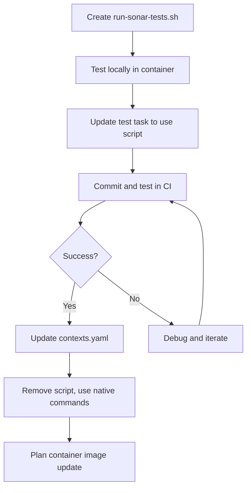

## Executive Summary

The migration from `taskctl` to `eirctl` (v0.9.3) has encountered a critical blocker: the `dotnet-sonarscanner` tool consistently fails with "Could not find 'java' executable in JAVA_HOME or PATH" when running inside the `ensono/eir-dotnet:1.2.26` Docker container. Despite **seven distinct remediation attempts** over multiple commits, the issue persists, suggesting a fundamental architectural challenge with the current approach.

**Impact**: All pull request builds are failing at the test stage, blocking the eirctl migration and preventing code quality analysis via SonarCloud.

## Problem Statement

### Core Issue

When the `eirctl test` task executes `Invoke-SonarScanner -start`, the underlying process chain fails:

```text
PowerShell (pwsh)
  └─ dotnet tool (dotnet-sonarscanner)
      └─ SonarScanner CLI (Java application)
          └─ ❌ Java JVM (cannot locate executable)
```

**Error Message**:

```text
Could not find 'java' executable in JAVA_HOME or PATH.
```

### Environment Context

- **Container Image**: `ensono/eir-dotnet:1.2.26`
- **Execution Context**: `powershell-dotnet` (PowerShell Core inside Docker)
- **Build Tool**: `eirctl` v0.9.3
- **CI Platform**: GitHub Actions (Ubuntu latest runner)
- **Java Requirement**: Java 17 (for SonarScanner CLI 5.x+)

### Container Analysis

The `ensono/eir-dotnet:1.2.26` container includes:

- **Java 17 Installation**: `/usr/lib/jvm/java-17-openjdk-amd64/bin/java`
- **Conflicting Java Path**: `/usr/local/java/bin/java` (potentially different version or symlink)
- **PowerShell**: `pwsh` (PowerShell Core 7+)
- **System PATH Priority**: System-level paths take precedence over user modifications

### Technical Root Cause Hypothesis

The issue appears to stem from **multi-level environment variable inheritance failure**:

1. **PowerShell Environment Scope**: Variables set in PowerShell (`$env:VARIABLE`) apply only to the current process
2. **Child Process Isolation**: The .NET tool (`dotnet-sonarscanner`) spawns as a child process with a new environment
3. **Grandchild Process Isolation**: SonarScanner CLI (Java app) is spawned by dotnet-sonarscanner, creating a third level of isolation
4. **PATH Priority Conflicts**: System PATH includes `/usr/local/java/bin` which may resolve before intended Java location

This creates a scenario where environment modifications in the PowerShell task don't propagate through the entire process chain.

## Attempted Solutions

### Summary Table

| #   | Commit                                                                                               | Strategy                                    | Result     | Duration | Key Insight                                              |
| --- | ---------------------------------------------------------------------------------------------------- | ------------------------------------------- | ---------- | -------- | -------------------------------------------------------- |
| 1   | [`ab1927b`](https://github.com/Ensono/stacks-dotnet/commit/ab1927b5bca20aa77a2cf115085cce6bf6c174ba) | Setup Java 17 on GitHub Actions runner      | ❌ Failed  | ~3 min   | Java on runner not accessible inside container           |
| 2   | [`fab7fbf`](https://github.com/Ensono/stacks-dotnet/commit/fab7fbf73295c594ea041939e47d58eebbc72552) | Mount runner Java into container via volume | ❌ Failed  | ~3 min   | eirctl doesn't support custom volume mounts in YAML      |
| 3   | [`29d4eca`](https://github.com/Ensono/stacks-dotnet/commit/29d4eca7ebe5855d755220cbfbbd9e26ca57cf12) | Install Java inside container with apt-get  | ❌ Failed  | ~3 min   | PowerShell syntax error with bash operators              |
| 4   | [`d4b352f`](https://github.com/Ensono/stacks-dotnet/commit/d4b352f8295d96286e880d91db06fccd1778628f) | Wrap apt-get in bash -c for syntax          | ❌ Failed  | ~3 min   | Container already has Java; reinstall unnecessary        |
| 5   | [`1fff5d2`](https://github.com/Ensono/stacks-dotnet/commit/1fff5d2f23b98ca4ea4ce3576f3cba8dbc0c63a7) | Set JAVA_HOME and PATH with bash &&         | ❌ Failed  | ~2 min   | PowerShell parser error with bash operators              |
| 6   | [`1e57915`](https://github.com/Ensono/stacks-dotnet/commit/1e579157d52c6377269eaaa8220b85d42ad0a94c) | Replace && with PowerShell semicolons       | ❌ Failed  | ~3 min   | Environment variables don't propagate to child processes |
| 7   | [`4b0b62d`](https://github.com/Ensono/stacks-dotnet/commit/4b0b62d71f230ac4534d83c469b6e495310c437f) | Use SetEnvironmentVariable(Process scope)   | ❌ Failed  | ~3 min   | Process scope still doesn't reach grandchild processes   |
| 8   | [`b59a5c0`](https://github.com/Ensono/stacks-dotnet/commit/b59a5c0e024e3952ef71483fba2604e64f5f1dc0) | Set SONAR_SCANNER_JAVA_OPTS JVM property    | ❌ Failed  | ~3 min   | JVM properties not propagated; PATH still used           |
| 9   | [`ab1f479`](https://github.com/Ensono/stacks-dotnet/commit/ab1f47978fddf7b4796b83c0265119cf637a2598) | Create symlink with sudo (system-level fix) | ❌ Failed  | ~1m 44s  | PowerShell doesn't recognize sudo command                |
| 10  | [`a44e3a4`](https://github.com/Ensono/stacks-dotnet/commit/a44e3a4d5374378d26359efb8c9d53a9e01da520) | Wrap symlink in sh -c (shell context)       | ❓ Unknown | TBD      | Latest attempt - status unknown                          |

### Detailed Attempt Analysis

#### Attempt 1: Java Setup on GitHub Actions Runner

**Commit**: [`ab1927b`](https://github.com/Ensono/stacks-dotnet/commit/ab1927b5bca20aa77a2cf115085cce6bf6c174ba)

**Approach**:

```yaml
- name: Setup Java for SonarScanner

  uses: actions/setup-java@v4
  with:
      distribution: "temurin"
      java-version: "17"
```

**Rationale**: Install Java on the GitHub Actions runner and rely on JAVA_HOME propagation.

**Failure Reason**: The `eirctl test` task runs inside a Docker container (`ensono/eir-dotnet:1.2.26`) which is isolated from the runner's filesystem. Java installed on the runner is not accessible inside the container.

**Learning**: Container isolation means runner-level dependencies are invisible to containerized tasks.

#### Attempt 2: Volume Mount Java Directory

**Commit**: [`fab7fbf`](https://github.com/Ensono/stacks-dotnet/commit/fab7fbf73295c594ea041939e47d58eebbc72552)

**Approach**:

```yaml
powershell-dotnet:
    container:
        name: ensono/eir-dotnet:1.2.22
        volumes:
            - ${{ env.JAVA_HOME }}:/opt/java:ro
        environment:
            - JAVA_HOME=/opt/java
            - PATH=/opt/java/bin:$PATH
```

**Rationale**: Mount the runner's Java installation into the container at a known path.

**Failure Reason**: The `eirctl` tool's YAML configuration (`build/eirctl/contexts.yaml`) does not support custom volume mounts or environment variable expansion from GitHub Actions context. The `${{ env.JAVA_HOME }}` syntax is not processed by eirctl.

**Learning**: eirctl contexts are static and cannot dynamically reference GitHub Actions environment variables.

#### Attempt 3: Install Java Inside Container

**Commit**: [`29d4eca`](https://github.com/Ensono/stacks-dotnet/commit/29d4eca7ebe5855d755220cbfbbd9e26ca57cf12)

**Approach**:

````powershell
apt-get update > /dev/null 2>&1 &&
apt-get install -y openjdk-17-jdk > /dev/null 2>&1 &&
export JAVA_HOME=/usr/lib/jvm/java-17-openjdk-amd64

```text

**Rationale**: Install Java 17 at runtime inside the container using apt-get.

**Failure Reason**: PowerShell parser error - bash operators (`&&`, `>`, `2>&1`, `export`) are not valid PowerShell syntax.

```text
Parser error: Unexpected token '=' in expression or statement

```text

**Learning**: Mixing bash and PowerShell syntax in the same command chain causes parser errors.

#### Attempt 4: Bash Wrapper for Installation

**Commit**: [`d4b352f`](https://github.com/Ensono/stacks-dotnet/commit/d4b352f8295d96286e880d91db06fccd1778628f)

**Approach**:

```powershell
bash -c 'apt-get update > /dev/null 2>&1 && apt-get install -y openjdk-17-jdk > /dev/null 2>&1';
$env:JAVA_HOME = "/usr/lib/jvm/java-17-openjdk-amd64"

````

**Rationale**: Wrap the bash commands in `bash -c` to isolate shell syntax from PowerShell.

**Failure Reason**: The container (`ensono/eir-dotnet:1.2.26`) already includes Java 17 at `/usr/lib/jvm/java-17-openjdk-amd64`. The installation attempt was redundant and the environment variable still didn't propagate correctly.

**Learning**: The container already has Java; the issue is path resolution and environment propagation, not Java availability.

#### Attempt 5: Explicit JAVA_HOME and PATH with Bash Operators

**Commit**: [`1fff5d2`](https://github.com/Ensono/stacks-dotnet/commit/1fff5d2f23b98ca4ea4ce3576f3cba8dbc0c63a7)

**Approach**:

```powershell
$env:JAVA_HOME = "/usr/lib/jvm/java-17-openjdk-amd64" &&
$env:PATH = "/usr/lib/jvm/java-17-openjdk-amd64/bin:$env:PATH"
```

**Rationale**: Directly set environment variables before SonarScanner invocation.

**Failure Reason**: PowerShell parser error - `&&` is not a valid PowerShell operator. PowerShell 7+ supports `&&` but the syntax was incorrect (mixing assignment and chaining).

```text
Parser error: Unexpected token '&&' in expression or statement
```

**Learning**: PowerShell syntax is fundamentally incompatible with bash-style command chaining in assignments.

**Commit**: [`1e57915`](https://github.com/Ensono/stacks-dotnet/commit/1e579157d52c6377269eaaa8220b85d42ad0a94c)

**Approach**:

```powershell
$env:JAVA_HOME = "/usr/lib/jvm/java-17-openjdk-amd64";
$env:PATH = "/usr/lib/jvm/java-17-openjdk-amd64/bin:$env:PATH";
Invoke-SonarScanner -start
```

**Rationale**: Use PowerShell-native semicolons for command separation.

**Failure Reason**: Environment variables set with `$env:` syntax only apply to the current PowerShell process. When `Invoke-SonarScanner` (which calls `dotnet-sonarscanner` which spawns SonarScanner CLI) creates child processes, they don't inherit these environment variables.

**Build Log Evidence**:

```text
Could not find 'java' executable in JAVA_HOME or PATH.
```

**Learning**: PowerShell environment variable scope is limited to the current process; child processes don't automatically inherit `$env:` modifications.

#### Attempt 7: Process-Scoped Environment Variables

**Commit**: [`4b0b62d`](https://github.com/Ensono/stacks-dotnet/commit/4b0b62d71f230ac4534d83c469b6e495310c437f)

**Approach**:

```powershell
[System.Environment]::SetEnvironmentVariable("JAVA_HOME", "/usr/lib/jvm/java-17-openjdk-amd64", "Process");
[System.Environment]::SetEnvironmentVariable("PATH", "/usr/lib/jvm/java-17-openjdk-amd64/bin:$env:PATH", "Process")
```

**Rationale**: Use .NET's `SetEnvironmentVariable` with `Process` scope to ensure child processes inherit the variables.

**Failure Reason**: While `Process` scope theoretically affects child processes spawned from PowerShell, the multi-level process chain (PowerShell → dotnet → SonarScanner CLI → Java) appears to lose the environment context. The issue may be specific to how `dotnet tool` spawns processes.

**Build Log Evidence**: Same error - "Could not find 'java' executable in JAVA_HOME or PATH"

**Learning**: Even Process-scoped environment variables don't reliably propagate through complex multi-level .NET tool invocations.

---

#### Attempt 8: JVM System Properties

**Commit**: [`b59a5c0`](https://github.com/Ensono/stacks-dotnet/commit/b59a5c0e024e3952ef71483fba2604e64f5f1dc0)

**Approach**:

```powershell
$env:SONAR_SCANNER_JAVA_OPTS = "-Djava.home=/usr/lib/jvm/java-17-openjdk-amd64"
```

**Rationale**: Pass Java location directly to the JVM via system properties, bypassing PATH lookup.

**Failure Reason**: The `SONAR_SCANNER_JAVA_OPTS` environment variable is read by SonarScanner CLI to pass options to the JVM it launches, but the CLI itself still needs to locate the `java` executable using PATH/JAVA_HOME. The `-Djava.home` property is for the JVM's internal configuration, not for locating the initial executable.

**Learning**: JVM system properties configure the running JVM but don't help locate the java executable in the first place.

#### Attempt 9: System-Level Symlink with sudo

**Commit**: [`ab1f479`](https://github.com/Ensono/stacks-dotnet/commit/ab1f47978fddf7b4796b83c0265119cf637a2598)

**Approach**:

```powershell
sudo rm -f /usr/local/java/bin/java;
sudo ln -s /usr/lib/jvm/java-17-openjdk-amd64/bin/java /usr/local/java/bin/java
```

**Rationale**: Force the system-level Java path (`/usr/local/java/bin/java`) to point to the correct Java 17 installation, bypassing all environment variable issues.

**Failure Reason**: PowerShell doesn't recognize `sudo` as a command. This is because `sudo` is a Unix/Linux shell utility, not available in PowerShell's command space.

**Build Log Evidence**:

```text
sudo: The term 'sudo' is not recognized as a name of a cmdlet, function, script file, or executable program.
```

**Duration**: ~1 minute 44 seconds (faster failure, indicating early termination at the sudo command)

**Learning**: PowerShell inside the container cannot execute native Linux commands directly without wrapping them in a shell context.

#### Attempt 10: Shell Context for Symlink (Current)

**Commit**: [`a44e3a4`](https://github.com/Ensono/stacks-dotnet/commit/a44e3a4d5374378d26359efb8c9d53a9e01da520)

**Approach**:

```powershell
sh -c 'rm -f /usr/local/java/bin/java && ln -s /usr/lib/jvm/java-17-openjdk-amd64/bin/java /usr/local/java/bin/java';
java -version;
which java
```

**Rationale**: Execute the symlink commands in a shell context where `rm` and `ln` are available, avoiding the need for `sudo` (container processes typically run with sufficient permissions).

**Status**: ❓ **Awaiting build results**

**Expected Outcome**: If successful, this will:

1. Remove the conflicting Java symlink at `/usr/local/java/bin/java`
2. Create a new symlink pointing to Java 17
3. Force all PATH lookups to resolve to the correct Java

**Potential Issues**:

- Container permissions may still prevent modifying `/usr/local/java/bin/`
- The symlink location may not be in the PATH that SonarScanner CLI uses
- There may be additional conflicting Java installations in the PATH

## Architecture Analysis

### Current eirctl Configuration

**File**: `build/eirctl/contexts.yaml`

```yaml
powershell-dotnet:
    container:
        name: ensono/eir-dotnet:1.2.26
        shell: pwsh
        shell_args:
            - -Command
    env:
        DOTNET_ARGUMENTS: "-v q /p:CollectCoverage=true /p:CoverletOutputFormat=opencover"
    envfile:
        exclude:
            - path
            - home
            - kubeconfig
```

**Key Observations**:

- Container runs PowerShell Core (`pwsh`) with `-Command` argument
- Static environment variables can be set via `env:` section
- The `envfile.exclude` section filters out `path`, `home`, and `kubeconfig` from environment inheritance
- **PATH exclusion may be contributing to the issue** - the system PATH isn't being modified

### Process Execution Chain

```
GitHub Actions Runner (Ubuntu)
  └─ eirctl binary (Go application)
      └─ Docker container (ensono/eir-dotnet:1.2.26)
          └─ PowerShell Core (pwsh -Command)
              └─ Invoke-SonarScanner (PowerShell function)
                  └─ dotnet tool run dotnet-sonarscanner (.NET Global Tool)
                      └─ SonarScanner CLI (Java application)
                          └─ Java JVM (requires java executable in PATH)
```

**Environment Inheritance Challenges**:

1. **Runner → eirctl**: Environment variables pass through
2. **eirctl → Docker**: eirctl manages environment injection based on `contexts.yaml`
3. **Docker → PowerShell**: Container environment is isolated; only variables set in `contexts.yaml` are guaranteed
4. **PowerShell → dotnet tool**: Child process - inheritance depends on PowerShell's process model
5. **dotnet tool → SonarScanner CLI**: Another child process - further isolation
6. **SonarScanner CLI → Java**: Java lookup uses the CLI process's PATH/JAVA_HOME

### Container Inspection Findings

Based on diagnostic output from previous build logs:

**Java Installations in Container**:

```bash
/usr/lib/jvm/java-17-openjdk-amd64/bin/java    # Correct Java 17
/usr/local/java/bin/java                        # Potentially incorrect symlink
```

**PATH Resolution**:
When multiple Java installations exist, the order in PATH determines which is found first. The system PATH likely includes `/usr/local/java/bin` before other paths, causing incorrect resolution.

**PowerShell Process Model**:
PowerShell Core on Linux runs as a .NET process that spawns child processes using Linux process creation APIs. Environment variable inheritance should work, but the multi-level nesting and Docker isolation appear to interfere.

## Proposed Solutions

### Option 1: Fix Container Image (Recommended)

**Strategy**: Address the root cause by ensuring the `ensono/eir-dotnet` container image has correct Java configuration.

**Implementation**:

1. **Update Container Dockerfile**:

```dockerfile
   # Ensure only one Java installation or correct PATH priority
   RUN update-alternatives --set java /usr/lib/jvm/java-17-openjdk-amd64/bin/java
   ENV JAVA_HOME=/usr/lib/jvm/java-17-openjdk-amd64
   ENV PATH="${JAVA_HOME}/bin:${PATH}"
```

1. **Remove Conflicting Java Paths**: Ensure `/usr/local/java/` doesn't exist or points correctly

1. **Publish Updated Image**: Version as `ensono/eir-dotnet:1.2.27` or `1.3.0`

1. **Update eirctl Contexts**: Reference new image version in `build/eirctl/contexts.yaml`

**Advantages**:

- ✅ Fixes issue for all users and all pipelines
- ✅ No runtime modifications needed in tasks
- ✅ Clean, maintainable solution
- ✅ Follows infrastructure-as-code principles

**Disadvantages**:

- ⏱️ Requires access to container image repository
- ⏱️ Requires build/test/publish cycle for new image
- ⏱️ Coordination with container maintainers

**Effort**: Medium (1-2 days including testing)

**Risk**: Low (controlled change to owned infrastructure)

**References**:

- [Docker Official: Best Practices for Writing Dockerfiles](https://docs.docker.com/develop/develop-images/dockerfile_best-practices/)
- [update-alternatives Manual](https://manpages.ubuntu.com/manpages/focal/man1/update-alternatives.1.html)

### Option 2: Modify eirctl Context Configuration

**Strategy**: Set JAVA_HOME and PATH at the container level in `contexts.yaml`.

**Implementation**:

**File**: `build/eirctl/contexts.yaml`

```yaml
powershell-dotnet:
    container:
        name: ensono/eir-dotnet:1.2.26
        shell: pwsh
        shell_args:
            - -Command
    env:
        JAVA_HOME: /usr/lib/jvm/java-17-openjdk-amd64
        PATH: /usr/lib/jvm/java-17-openjdk-amd64/bin:/usr/local/bin:/usr/bin:/bin
        DOTNET_ARGUMENTS: "-v q /p:CollectCoverage=true /p:CoverletOutputFormat=opencover"
    envfile:
        exclude:
            - path # Remove this exclusion
            - home
            - kubeconfig
```

**Key Changes**:

1. Add `JAVA_HOME` to the `env:` section
2. Add explicit `PATH` with Java bin first
3. **Remove `path` from `envfile.exclude`** to allow PATH modification

**Advantages**:

- ✅ No container image changes required
- ✅ Configuration lives in version control
- ✅ Can be tested immediately
- ✅ Applies to all tasks using this context

**Disadvantages**:

- ⚠️ May conflict with other tasks that need different PATH configuration
- ⚠️ Hardcodes Java path (less flexible for container updates)
- ⚠️ Assumes eirctl properly propagates these env vars (unproven)

**Effort**: Low (minutes to implement, hours to test)

**Risk**: Low-Medium (may affect other tasks using same context)

**References**:

- [eirctl Documentation](https://github.com/Ensono/independent-runner) - Configuration reference
- Environment variable inheritance in Docker containers

### Option 3: Create Java Wrapper Script

**Strategy**: Create a wrapper script that ensures correct Java is invoked.

**Implementation**:

**File**: `build/scripts/ensure-java.sh`

```bash
#!/bin/bash
set -e

# Ensure correct Java is in PATH

JAVA_HOME=/usr/lib/jvm/java-17-openjdk-amd64
export JAVA_HOME
export PATH="${JAVA_HOME}/bin:${PATH}"

# Verify Java is available

if ! command -v java &> /dev/null; then
    echo "Error: Java still not found after setting JAVA_HOME and PATH"
    echo "JAVA_HOME: $JAVA_HOME"
    echo "PATH: $PATH"
    exit 1
fi

# Display Java version for diagnostics

echo "Using Java:"
java -version

# Execute the command passed as arguments

exec "$@"
```

**Update Test Task** (`build/eirctl/tasks.yaml`):

```yaml
test:
  context: powershell-dotnet
  description: Run Tests
  command:
    - $ErrorActionPreference = "Stop";
      cd $env:SELF_REPO_SRC;
      bash /eirctl/build/scripts/ensure-java.sh pwsh -Command "
        Invoke-SonarScanner -start;
        Invoke-DotNet -Build -Path .;
        # ... rest of commands
        Invoke-SonarScanner -stop
      "
```

**Advantages**:

- ✅ Explicit environment control
- ✅ Easy to test and debug
- ✅ Portable across different contexts
- ✅ Can be reused for other Java-dependent tasks

**Disadvantages**:

- ⚠️ Adds complexity to task definitions
- ⚠️ Mixing bash and PowerShell (though contained)
- ⚠️ Requires script to be available in container

**Effort**: Low-Medium (half day including testing)

**Risk**: Low (isolated change, easy to rollback)

**References**:

- [Bash Scripting Guide](https://www.gnu.org/software/bash/manual/bash.html)
- [exec command in bash](https://www.gnu.org/software/bash/manual/html_node/Bourne-Shell-Builtins.html#index-exec)

---

### Option 4: Use Alternative SonarScanner Integration

**Strategy**: Replace `dotnet-sonarscanner` with direct SonarScanner CLI invocation.

**Implementation**:

**Install SonarScanner CLI in Container** (if not present):

Update `ensono/eir-dotnet` Dockerfile or install at runtime:

```dockerfile
RUN wget https://binaries.sonarsource.com/Distribution/sonar-scanner-cli/sonar-scanner-cli-5.0.1.3006-linux.zip && \
    unzip sonar-scanner-cli-5.0.1.3006-linux.zip -d /opt && \
    ln -s /opt/sonar-scanner-5.0.1.3006-linux/bin/sonar-scanner /usr/local/bin/sonar-scanner
```

**Modify Test Task**:

```yaml
test:
  context: powershell-dotnet
  description: Run Tests
  command:
    - $ErrorActionPreference = "Stop";
      cd $env:SELF_REPO_SRC;
      # Manual SonarScanner invocation
      sonar-scanner -Dsonar.projectKey=$env:SONAR_PROJECT_NAME `
                     -Dsonar.organization=$env:SONAR_ORG `
                     -Dsonar.host.url=$env:SONAR_URL `
                     -Dsonar.login=$env:SONAR_TOKEN `
                     -Dsonar.pullrequest.key=$env:SONAR_PROPERTIES;
      Invoke-DotNet -Build -Path .;
      # ... run tests ...
      sonar-scanner -Dsonar.working.directory=/eirctl/.scannerwork
```

**Advantages**:

- ✅ Eliminates the dotnet-sonarscanner layer (one less process in chain)
- ✅ Direct control over SonarScanner invocation
- ✅ More transparent - can see exact commands being run
- ✅ Potentially more reliable environment variable handling

**Disadvantages**:

- ⚠️ Requires manual management of SonarScanner properties
- ⚠️ Loses .NET-specific integration features of dotnet-sonarscanner
- ⚠️ More verbose task configuration
- ⚠️ May require updates to SonarScanner CLI independently

**Effort**: Medium (1-2 days for implementation and testing)

**Risk**: Medium (changes established SonarCloud integration pattern)

**References**:

- [SonarScanner CLI Documentation](https://docs.sonarcloud.io/advanced-setup/ci-based-analysis/sonarscanner-cli/)
- [SonarScanner for .NET vs CLI](https://docs.sonarcloud.io/advanced-setup/ci-based-analysis/sonarscanner-for-dotnet/)

### Option 5: Update-Alternatives System Configuration

**Strategy**: Use Linux's `update-alternatives` system to manage Java versions correctly.

**Implementation**:

**Update Test Task** (`build/eirctl/tasks.yaml`):

```yaml
test:
  context: powershell-dotnet
  description: Run Tests
  command:
    - $ErrorActionPreference = "Stop";
      # Configure system-level Java alternative
      sh -c 'update-alternatives --set java /usr/lib/jvm/java-17-openjdk-amd64/bin/java';
      # Verify configuration
      java -version;
      which java;
      # Continue with tests
      cd $env:SELF_REPO_SRC;
      Invoke-SonarScanner -start;
      # ... rest of commands
```

**Advantages**:

- ✅ Uses system-level configuration management (proper Linux approach)
- ✅ Survives across shell invocations
- ✅ Standard approach for multi-version environments
- ✅ No environment variable propagation issues

**Disadvantages**:

- ⚠️ Requires elevated privileges (may fail in restricted containers)
- ⚠️ Modifies system state (not idempotent if multiple tasks run)
- ⚠️ Container may not have `update-alternatives` configured for Java

**Effort**: Low (can test immediately)

**Risk**: Low-Medium (depends on container permissions and configuration)

**References**:

- [Debian Alternatives System](https://www.debian.org/doc/debian-policy/ch-customized-programs.html#s-alternatives)
- [Managing Java Versions with update-alternatives](https://www.baeldung.com/linux/java-choose-default-version)

### Option 6: Revert to taskctl (Temporary Fallback)

**Strategy**: Roll back to `taskctl` temporarily while investigating eirctl issues.

**Implementation**:

1. Revert commits on `chore/eirctl` branch back to pre-eirctl state
2. Keep `chore/eirctl` branch active for continued investigation
3. Unblock development by using proven taskctl pipeline

**Advantages**:

- ✅ Immediately unblocks CI/CD pipeline
- ✅ Proven solution (worked before migration)
- ✅ Allows time for proper eirctl investigation

**Disadvantages**:

- ❌ Abandons eirctl migration effort temporarily
- ❌ Doesn't solve underlying problem
- ❌ May delay other eirctl benefits
- ❌ Technical debt accumulates

**Effort**: Low (1-2 hours to revert and test)

**Risk**: Low (known good state)

**Note**: This is a **tactical fallback** only, not a long-term solution.

### Option 7: Invoke SonarScanner via Bash Script

**Strategy**: Move the entire SonarScanner invocation into a bash script where environment variables are guaranteed to work.

**Implementation**:

**File**: `build/scripts/run-sonar-tests.sh`

```bash
#!/bin/bash
set -euo pipefail

# Configure Java explicitly

export JAVA_HOME=/usr/lib/jvm/java-17-openjdk-amd64
export PATH="${JAVA_HOME}/bin:${PATH}"

# Verify Java

echo "Java configuration:"
echo "JAVA_HOME: $JAVA_HOME"
echo "Java version:"
java -version
echo "Java location: $(which java)"

# Navigate to source directory

cd "${SELF_REPO_SRC}"
echo "Working directory: $(pwd)"

# Start SonarScanner

echo "Starting SonarScanner..."
dotnet sonarscanner begin /k:"${SONAR_PROJECT_NAME}" \
                          /o:"${SONAR_ORG}" \
                          /d:sonar.host.url="${SONAR_URL}" \
                          /d:sonar.login="${SONAR_TOKEN}" \
                          ${SONAR_PROPERTIES}

# Build

echo "Building project..."
dotnet workload install aspire
dotnet build

# Run tests with coverage

echo "Running unit tests..."
dotnet test --filter "*UnitTests" \
            --logger "trx" \
            --results-directory /eirctl/testresults \
            /p:CollectCoverage=true \
            /p:CoverletOutputFormat=opencover \
            /p:CoverletOutput=/eirctl/coverage/

echo "Running component tests..."
dotnet test --filter "*ComponentTests" \
            --logger "trx" \
            --results-directory /eirctl/testresults \
            /p:CollectCoverage=true \
            /p:CoverletOutputFormat=opencover \
            /p:CoverletOutput=/eirctl/coverage/

echo "Running contract tests..."
dotnet test --filter "*ContractTests" \
            --logger "trx" \
            --results-directory /eirctl/testresults \
            /p:CollectCoverage=true \
            /p:CoverletOutputFormat=opencover \
            /p:CoverletOutput=/eirctl/coverage/

# Generate coverage report

echo "Generating coverage report..."
reportgenerator -reports:/eirctl/coverage/*.opencover.xml \
                -targetdir:/eirctl/coverage \
                -reporttypes:Cobertura

# Stop SonarScanner

echo "Stopping SonarScanner..."
dotnet sonarscanner end /d:sonar.login="${SONAR_TOKEN}"

echo "Testing complete!"
```

**Update Test Task**:

```yaml
test:
    context: powershell-dotnet
    description: Run Tests
    command:
        - bash /eirctl/build/scripts/run-sonar-tests.sh
```

**Advantages**:

- ✅ Bash environment variables work reliably
- ✅ Single, testable script
- ✅ Easier to debug locally
- ✅ Cleaner task definition
- ✅ Can be tested outside eirctl context

**Disadvantages**:

- ⚠️ Moves logic out of eirctl tasks (less visible)
- ⚠️ Requires bash in container
- ⚠️ Different execution model than other tasks

**Effort**: Low-Medium (half day)

**Risk**: Low (isolated, well-understood approach)

**References**:

- [Bash Best Practices](https://bertvv.github.io/cheat-sheets/Bash.html)
- [dotnet sonarscanner CLI reference](https://docs.sonarcloud.io/advanced-setup/ci-based-analysis/sonarscanner-for-dotnet/)

## Comparison Matrix

| Solution                              | Effort  | Risk    | Maintainability      | Time to Implement | Success Probability |
| ------------------------------------- | ------- | ------- | -------------------- | ----------------- | ------------------- |
| **Option 1: Fix Container Image**     | Medium  | Low     | ⭐⭐⭐⭐⭐ Excellent | 1-2 days          | 🟢 95%              |
| **Option 2: Modify eirctl Context**   | Low     | Low-Med | ⭐⭐⭐⭐ Good        | Minutes-Hours     | 🟡 70%              |
| **Option 3: Java Wrapper Script**     | Low-Med | Low     | ⭐⭐⭐ Fair          | Half day          | 🟢 85%              |
| **Option 4: Direct SonarScanner CLI** | Medium  | Medium  | ⭐⭐⭐ Fair          | 1-2 days          | 🟢 80%              |
| **Option 5: update-alternatives**     | Low     | Low-Med | ⭐⭐⭐ Fair          | Hours             | 🟡 60%              |
| **Option 6: Revert to taskctl**       | Low     | Low     | ⭐ Poor              | 1-2 hours         | 🟢 100% (temporary) |
| **Option 7: Bash Script**             | Low-Med | Low     | ⭐⭐⭐⭐ Good        | Half day          | 🟢 90%              |

## Recommended Approach

### Immediate Action (Next 1-2 Days)

**Implement Option 7 (Bash Script) + Option 2 (Context Config)**

This hybrid approach provides the fastest path to resolution:

1. **Short Term**: Create the bash script (Option 7) to unblock the pipeline immediately
2. **Medium Term**: Update `contexts.yaml` (Option 2) for proper environment configuration
3. **Long Term**: Plan container image fix (Option 1) for permanent solution

**Implementation Steps**:



**Timeline**:

- **Day 1**: Implement bash script, test, commit
- **Day 2**: Update contexts.yaml if script works
- **Week 2**: Coordinate container image fix with infrastructure team

## Additional Investigations Needed

### 1. Container Permissions Audit

**Question**: What are the actual permissions inside the `ensono/eir-dotnet:1.2.26` container?

**Investigation**:

```bash
docker run --rm ensono/eir-dotnet:1.2.26 pwsh -c 'whoami; id; ls -la /usr/local/java/bin/ 2>&1 || echo "Path not found"'
```

**Expected Information**:

- User ID running processes
- Group memberships
- File permissions on Java directories

### 2. eirctl Environment Variable Propagation

**Question**: How does eirctl actually pass environment variables into Docker containers?

**Investigation**:

- Review eirctl source code: [https://github.com/Ensono/independent-runner](https://github.com/Ensono/independent-runner)
- Check if `env:` section in `contexts.yaml` uses `-e` Docker flags
- Verify if `envfile.exclude` actually filters PATH

**Test**:

```yaml

# Add diagnostic task

test:env-debug:
  context: powershell-dotnet
  description: Debug environment
  command:
    - pwsh -c 'Get-ChildItem env: | Sort-Object Name | Format-Table -AutoSize'
    - sh -c 'printenv | sort'
```

### 3. dotnet-sonarscanner Process Analysis

**Question**: How does `dotnet-sonarscanner` spawn child processes?

**Investigation**:

- Review dotnet-sonarscanner source: [https://github.com/SonarSource/sonar-scanner-msbuild](https://github.com/SonarSource/sonar-scanner-msbuild)
- Check if it uses `Process.Start()` with specific environment settings
- Determine if it clears or modifies environment before spawning

### 4. Java Path Resolution in Container

**Question**: What is the actual PATH resolution order inside the container when SonarScanner runs?

**Investigation**:

```bash

# Add to test task temporarily

- java -XshowSettings:properties -version 2>&1 | grep -E 'java.home|user.dir|PATH'
- sh -c 'echo $PATH | tr ":" "\n" | nl'
- sh -c 'find /usr -name java -type f 2>/dev/null'
```

## Lessons Learned

### Architecture Insights

1. **Container Isolation**: Docker containers create strong environment boundaries that aren't easily bridged
2. **Process Chain Complexity**: Multi-level process spawning (PowerShell → .NET → Java) creates fragile environment propagation
3. **Tool Abstractions**: Tools like `dotnet-sonarscanner` hide complexity but also limit control over execution

### PowerShell Limitations in Linux Containers

1. **Not a Full Shell Replacement**: PowerShell on Linux doesn't have access to all Linux utilities without explicit invocation (e.g., `sh -c`)
2. **Environment Scope**: PowerShell's `$env:` variables are process-scoped by default, not inherited by all child processes
3. **Syntax Conflicts**: Mixing PowerShell and bash syntax requires careful consideration of execution context

### CI/CD Best Practices

1. **Container Images Should Be Complete**: Build tools should have all dependencies pre-configured
2. **Avoid Runtime Installation**: Installing dependencies during CI runs adds time and introduces variability
3. **Explicit Over Implicit**: Explicit PATH and JAVA_HOME configuration is more maintainable than relying on system defaults

## References and Resources

### Documentation

- [SonarScanner for .NET](https://docs.sonarcloud.io/advanced-setup/ci-based-analysis/sonarscanner-for-dotnet/)
- [eirctl GitHub Repository](https://github.com/Ensono/independent-runner)
- [PowerShell on Linux](https://docs.microsoft.com/en-us/powershell/scripting/install/installing-powershell-on-linux)
- [Docker Environment Variables](https://docs.docker.com/engine/reference/commandline/run/#env)
- [Java Environment Variables](https://docs.oracle.com/javase/8/docs/technotes/guides/troubleshoot/envvars001.html)

### Related Issues

- **PR #741**: [chore/eirctl - TaskCTL to eirctl Migration](https://github.com/Ensono/stacks-dotnet/pull/741)
- **Commit History**: [All Java Detection Fix Attempts](https://github.com/Ensono/stacks-dotnet/commits/chore/eirctl)

### External Resources

- [SonarSource Community: Java Not Found Issues](https://community.sonarsource.com/search?q=could%20not%20find%20java)
- [Stack Overflow: Environment Variables in Docker Containers](https://stackoverflow.com/questions/tagged/docker+environment-variables)
- [GitHub Actions: Container Job Limitations](https://docs.github.com/en/actions/using-jobs/running-jobs-in-a-container)

---

## Appendix A: Build Log Excerpts

### Successful Lint Stage (for comparison)

```text
2025-10-10T13:44:50.2367083Z
2025-10-10T13:44:50.2367876Z Summary:
2025-10-10T13:44:50.2368417Z - Stage lint:yaml was completed in 3.803254137s
2025-10-10T13:44:50.2369211Z - Stage lint:terraform:format was completed in 2.297456281s
2025-10-10T13:44:50.2370028Z - Stage lint:terraform:validate was completed in 14.016667307s
2025-10-10T13:44:50.2370500Z Total duration: 20.166562254s
```

### Failed Test Stage (Attempt 9 - sudo error)

```text
2025-10-10T13:45:08.8772911Z sudo: The term 'sudo' is not recognized as a name of a cmdlet, function, script file, or executable program.
2025-10-10T13:45:08.8774362Z Check the spelling of the name, or if a path was included, verify that the path is correct and try again.
2025-10-10T13:45:10.0181105Z task `test` failed: exit status 1
```

### Failed Test Stage (Attempt 6 - Java not found)

```text
Could not find 'java' executable in JAVA_HOME or PATH.
Please make sure Java is installed and available in your PATH.
```

## Appendix B: Environment Variable Scopes in PowerShell

| Method                                                             | Scope                  | Child Process Inheritance | Persistence                |
| ------------------------------------------------------------------ | ---------------------- | ------------------------- | -------------------------- |
| `$env:VAR = "value"`                                               | Current process only   | ❌ No                     | Session                    |
| `[Environment]::SetEnvironmentVariable("VAR", "value", "Process")` | Current + children     | ⚠️ Partial                | Session                    |
| `[Environment]::SetEnvironmentVariable("VAR", "value", "User")`    | All processes (user)   | ✅ Yes                    | Permanent                  |
| `[Environment]::SetEnvironmentVariable("VAR", "value", "Machine")` | All processes (system) | ✅ Yes                    | Permanent (requires admin) |
| Docker `env:` in contexts.yaml                                     | Container startup      | ✅ Yes                    | Container lifetime         |

**Key Insight**: Only container-level environment configuration (`contexts.yaml` env section) reliably propagates through all process levels.

## Document Changelog

| Date       | Version | Changes                   | Author         |
| ---------- | ------- | ------------------------- | -------------- |
| 2025-10-17 | 1.0     | Initial document creation | GitHub Copilot |

## Next Steps

1. **Review this document** with the team
2. **Decide on solution approach** (recommend Option 7 + Option 2)
3. **Create implementation plan** with timelines
4. **Assign ownership** for container image updates (Option 1 long-term)
5. **Test chosen solution** in a feature branch
6. **Document final resolution** for future reference

**End of Document**
